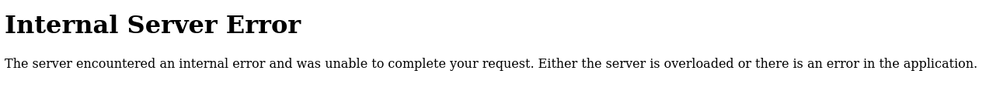

# Hacker101-CTF FLAG 0

First, I want to find all the possible URLs, so I'm going to be making use of FFUF. I'm going to be using the `common.txt` wordlist that contains common URLs; it's included in the Kali distro.

```bash
ffuf -w /usr/share/wordlists/dirb/common.txt -u url/FUZZ
```


I don't see any interesting URLs apart from login right now, so we are going to try over there.

Upon accessing the login page, the first thing I think of is SQL Injection (SQLI). As always, I start by using a ' in the username and password fields. This leads to a server error.



This makes me guess that it's probably vulnerable to SQLI! By playing around with queries and helped by a Hacker101 hint, I found out that I had to use UNION. Finally, I got a match!

username: ' UNION SELECT '123' as password #
password: 123

I logged in!

By going to the Home page and navigating to page 3, we get Flag 0.


